# Module 02: Image Creation , Management & Registry
* [Docker Registry](https://github.com/chaulags/learnDocker/tree/main/Module02#docker-registry)
* [Docker Images & Layers](https://github.com/chaulags/learnDocker/tree/main/Module02#docker-images--layers)
* [Working with Containers](https://github.com/chaulags/learnDocker/tree/main/Module02#working-with-containers)
* [Process in Containers](https://github.com/chaulags/learnDocker/tree/main/Module02#process-in-containers)
* [Docker Lifecycles](https://github.com/chaulags/learnDocker/tree/main/Module02#docker-lifecycles)
* [Docker Commit & Push](https://github.com/chaulags/learnDocker/tree/main/Module02#docker-commit--push)

## Docker Registry
* Let's start with simple docker image.
* Docker Hub will be used to fetch the docker images from the docker registry.
* Go and create and account in [Docker Hub](https://hub.docker.com/) so that it will help you help you in later chapters.

```
https://hub.docker.com/
```


## Docker Images & Layers
* Search "Ubuntu" in docker hub to find the base template of the ubuntu OS.
* You can see offical docker image for Ubuntu.

* Use following commands to download/pull the image to your own local system.
```
docker pull ubuntu
```
* If you are having any error such as permission denied or similar, use:
```
sudo docker pull ubuntu
```
\


* Wait for some seconds or minutes, depending upon your internet speed.
* After the pull operation has been completed, use following commands to view your docker images in you local system.
```
docker images
```
\
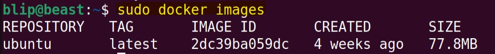

* To run the image, use:
```
docker run -i -t ubuntu:latest
```
* The above command's options are described as follows:
  * -i = Interactive session with the container that is to be executed.
  * -t = To make sure the session is interactive, a terminal is required. Hence.
  * ubuntu/ubuntu:latest = imageName:versionNumber 
\
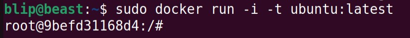

* You can now interact with the running docker container through a terminal.


## Working with Containers
* As you already have opened an interactive session by running a docker cotainer.
* Wait a second before doing anything. Let's understand whats happenning here.
* Docker Image is just a template for a container. Container is a executed version of the template environment itself.
\

* We can also view the information about container and its state, the following commands can be used.
```
docker ps -a
```
  * -a = Show all containers (default shows just running)
\
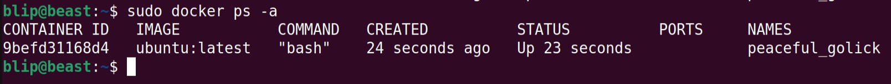

* Remember the information you have here. You'll be coming here a lot.
* You have a terminal access to the docker container running a Ubuntu.
* Use it for a while, see if you can find any difference.
\


* There are various information about the container:
  * Container ID = Randomly generated ID to specify the running instance. 
  * Image = The image used to create the container.
  * Command = The command executed while running the container(for ubuntu "bash" was executed)
  * Created = Time it has been created for.
  * Status = Running, exited.
  * Port = Any exposed ports
  * Name = Randomly generated name, these names can be used instead of container ID to execute stuffs. --name option can be used to give your own name for the container. 
* Now Exit the terminal.
* Use the command that displays the [information about container and its state](https://github.com/chaulags/learnDocker/tree/main/Module02#working-with-containers).
* What are the changes you can see ?
\


* Note down the changes you see.
\
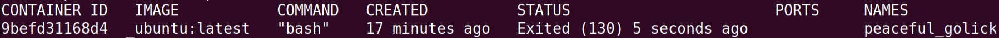


## Process in Containers
* You can also run a container without attaching to it.
```
docker run -it -d ubuntu:latest
```
\
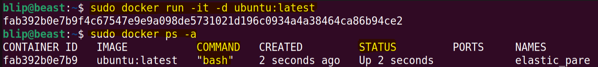
* View the information about running container
* You can also attach yourself to docker container using:
```
docker attach <container id>
```
\
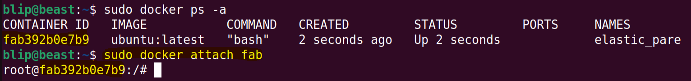

* You can also using following key combination for detaching yourself from a container:
```
CTRL + Q
```
* You can also view running processess without attaching to a docker container.
```
docker top <container id>
```
\
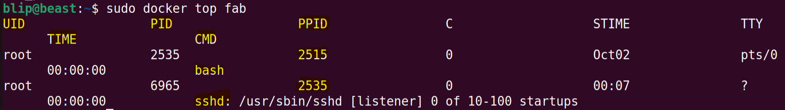

NOTE: do start ssh service in you container the view similar output as above.

## Docker Lifecycles
* Docker container can also be just created without running it.
```
sudo docker container create -i -t --name myUbuntu ubuntu:latest
```
\
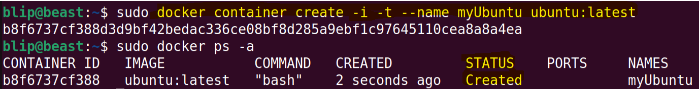

* Now the created docker container can be started using following commands:
```
sudo docker container start --attach -i myUbuntu
```
\
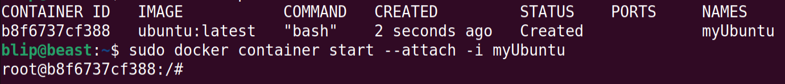
\
* Docker status can be checked
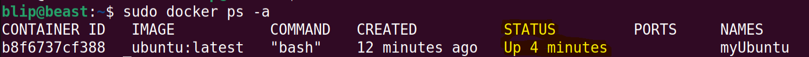

* From this illustration , we can undertand that above commands are equivalent to:
```
sudo docker run -it --name myUbuntu ubuntu:latest
```

* Following are the Docker lifecycle stages:


## Docker Commit & Push
* Docker container are just an instance of a docker images.
* If the docker container are deleted, any changes will be deleted with it.
* So, if a docker image is to be saved, we can use docker commit.
* Docker commit will create your container's instance as an image.
* So next time you start this new image, it will have everything you want.

```
docker commit <containerID> <newImageName:version>
```
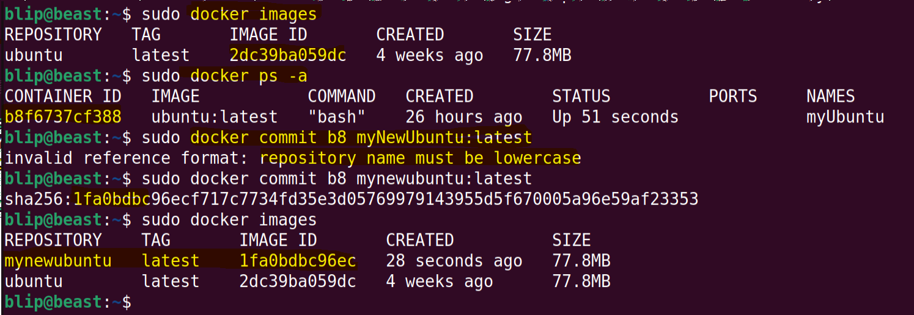

* Congratulation on you first commit.
* This images of yours can also be uploaded to DockerHub, but first you need to login.
```
docker login
```
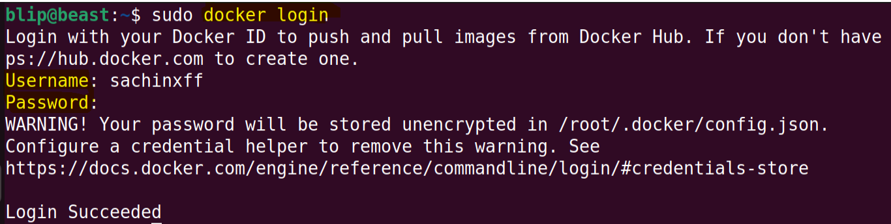

* Now use following commands to push your image to DockerHub

```
docker push <imageName:version>
```
But,


* You get error, something like this:


* That's because you also need to specify your repository.
* You can do that using docker tag.

```
docker tag <imageID> <repoName/imageName:versionNumber>
```
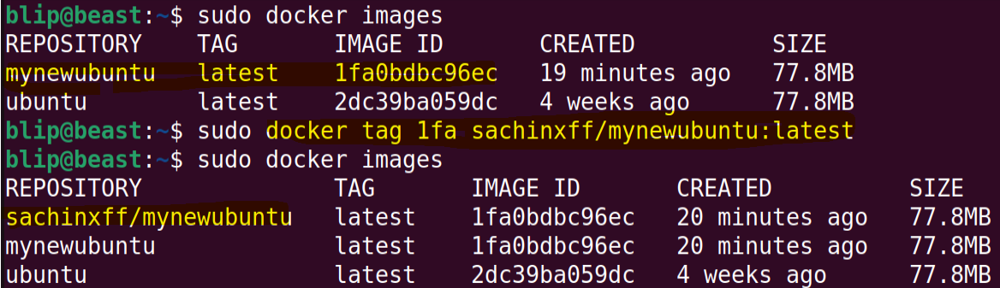

* Now, Let's Push again
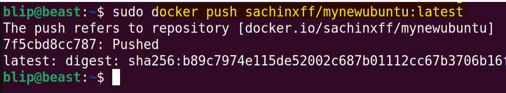

**This is the end of module 2**

[>> **Module 3**](https://github.com/chaulags/learnDocker/tree/main/Module03#module-03-docker-storage-and-volumes)

[* * * Go To Top * * * ](https://github.com/chaulags/learnDocker/tree/main/Module02#module-02-image-creation--management--registry)


