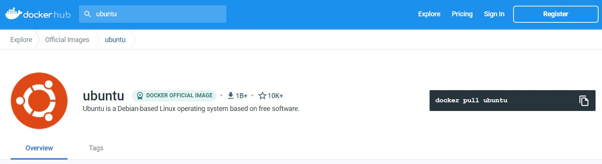

# Module 02: Image Creation , Management & Registry
* [Docker Registry](https://github.com/chaulags/learnDocker/tree/main/Module02#docker-registry)
* [Docker Images & Layers](https://github.com/chaulags/learnDocker/tree/main/Module02#docker-images--layers)
* [Working with Containers](https://github.com/chaulags/learnDocker/tree/main/Module02#working-with-containers)
* [Process in Containers](https://github.com/chaulags/learnDocker/tree/main/Module02#process-in-containers)
* [Docker Lifecycles](https://github.com/chaulags/learnDocker/tree/main/Module02#docker-lifecycles)
* [Docker Commit](https://github.com/chaulags/learnDocker/tree/main/Module02#docker-commit)

## Docker Registry
* Let's start with simple docker image.
* Docker Hub will be used to fetch the docker images from the docker registry.
* Go and create and account in [Docker Hub](https://hub.docker.com/) so that it will help you help you in later chapters.

```
https://hub.docker.com/
```


## Docker Images & Layers
* Search "Ubuntu" in docker hub to find the base template of the ubuntu OS.
* You can see offical docker image for Ubuntu.

* Use following commands to download/pull the image to your own local system.
```
docker pull ubuntu
```
* If you are having any error such as permission denied or similar, use:
```
sudo docker pull ubuntu
```
* Wait for some seconds or minutes, depending upon your internet speed.
* After the pull operation has been completed, use following commands to view your docker images in you local system.
```
docker images
```
* To run the image, use:
```
docker run -i -t ubuntu/ubuntu:latest
```
* The above command's options are described as follows:
  * -i = Interactive session with the container that is to be executed.
  * -t = To make sure the session is interactive, a terminal is required. Hence.
  * ubuntu/ubuntu:latest = publisherName/imageName:versionNumber 
* You can now interact with the running docker container through a terminal.

## Working with Containers
* As you already have opened an interactive session by running a docker cotainer.
* Wait a second before doing anything. Let's understand whats happenning here.
* Docker Image is just a template for a container. Container is a executed version of the template environment itself.

* We can also view the information about container and its state, the following commands can be used.
```
docker ps -a
```
  * -a = Show all containers (default shows just running)
* Remember the information you have here. You'll be coming here a lot.
* You have a terminal access to the docker container running a Ubuntu.
* Use it for a while, see if you can find any difference.
\

\
* Now Exit the terminal.
* Use the command that displays the [information about container and its state](https://github.com/chaulags/learnDocker/tree/main/Module02#working-with-containers).
* What are the changes you can see ?
\

\
* Note down the changes you see.

## Process in Containers

## Docker Lifecycles


## Docker Commit

