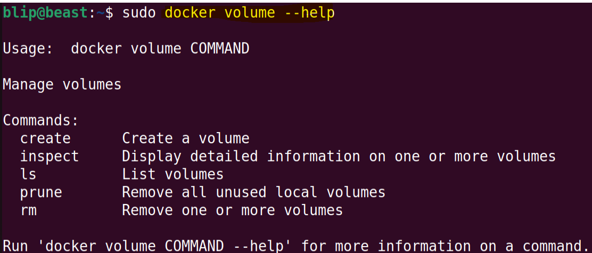
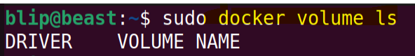
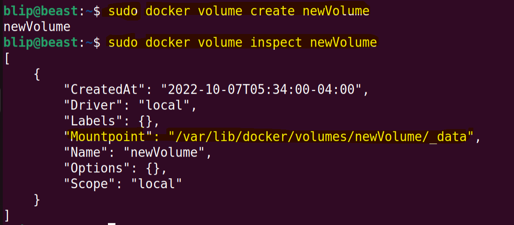
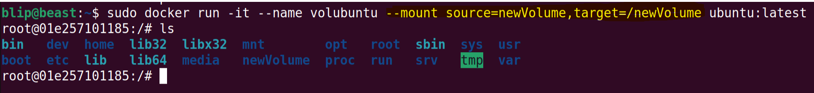
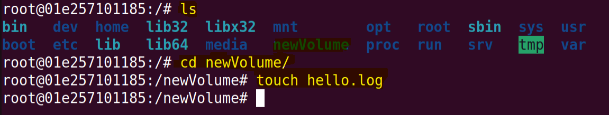
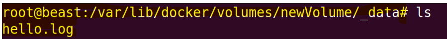
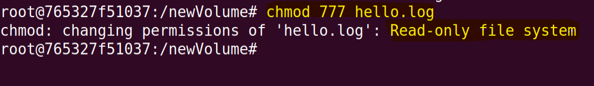

# Module 03: Docker Storage and Volumes
 * [Understanding the need for Volume service in Docker]()
 * [Create and Manage volumes]()
 * [Start a container with a volume]()
 * [Populate data in a volume using a container]()
 * [Use a read - only volume]()
 * [Understanding various Volume Plug-ins]()

 ## Understanding the need for Volume service in Docker
 * Docker volumes are file systems mounted on running containers to make sure that the data generated is preserved even after the docker container is stopped.
 * Its independent to the container and its lifecycle.
 * This helps to share required files from host system to container.
 * This storage implementation is also optimal for retrieving, storing, and transferring images across various environments.
 * Can be mapped to local storage.
 * Multiple container can use the same volume.

 ## Create and Manage volumes
 * We can use following commands to view volume information.
 * Try to explore more about volume using the following information:
```
sudo docker volume --help
```


```
sudo docker volume ls
```



 #### Create a volume & Inspect.
 * To create a volume, use following commands:
```
sudo docker volume create <volumeName>
```
 * To view information about the volume just created, use:
```
sudo docker volume inspect <volumeName> 
```


 
 ## Start a container with a volume
 * *--mount* will help to mount the volume create. Make sure to give proper parameters.
 ```
 sudo docker run -it --name <contName> --mount source=<volName>,target=<insideTheContainer> <dockerImage:versionNumber>
 ```
 
 * We can also use different way to mount a docker volume.
```
sudo docker run -it -v <source>:<target> <dockerImage:versionNumber>
```


* In a different scenerio, you can also directly load your host's directory in the container itself by using
  ```
  sudo docker run -it -v <hostDirectoryPath>:<targetPath> <dockerImage:versionNumber>
  ```

 ## Populate data in a volume using a container
* You can create file such as following to create a persistent work.


* To verify your files, inspect the volume and look at the files created.


* Similarly, you can also configure web servers to send their logs here or application's persistent data that is to be stored.

 ## Use a read - only volume
 * Sometime you need the volume just to load configuration into the container.
 * You dont want docker container to change anything but just to read.
 * You can use following command or add parameter to make the mounted volume readonly.
```
sudo docker run -it --name <contName> --mount source=<volName>,target=<insideTheContainer>,readonly <dockerImage:versionNumber>
```
  * Try Writing something inside it.
  
  * Even if you tried to change its permission, this is what you will get!
  

 ## Understanding various Volume Plug-ins
 * Docker Engine volume plugins enable Engine deployments to be integrated with external storage systems such as Amazon EBS, and enable data volumes to persist beyond the lifetime of a single Docker host.
 * That's something related to cloud so we will deal such tech later.

[End of Module 3]()

[ * * Go to Top * * ]()


