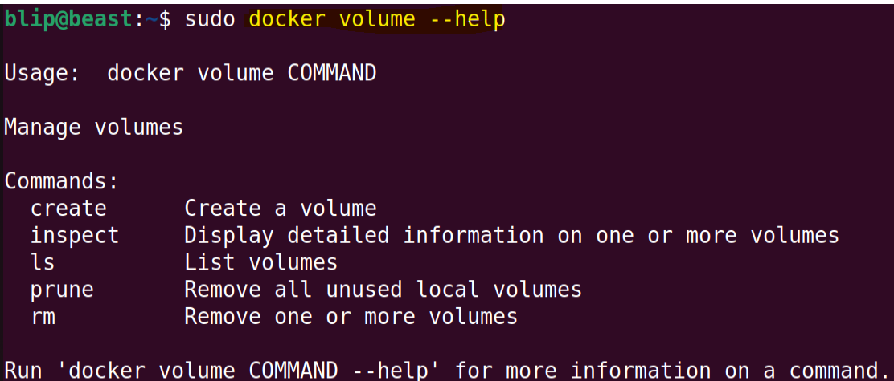
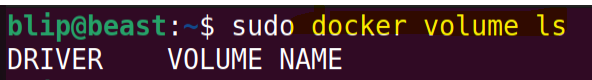
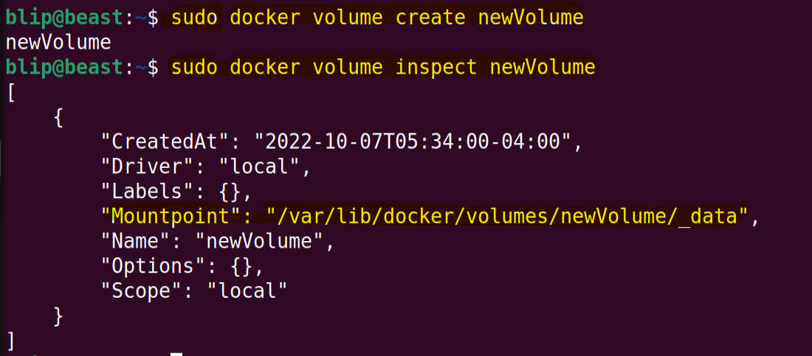
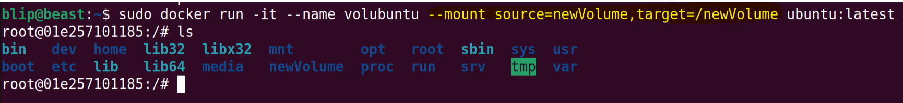
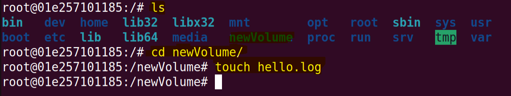
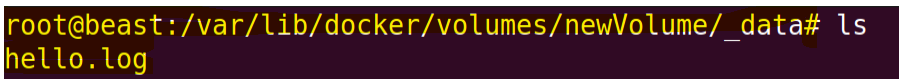
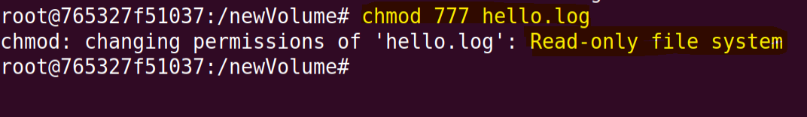

# Module 03: Docker Storage and Volumes
 * [Understanding the need for Volume service in Docker](https://github.com/chaulags/learnDocker/tree/main/Module03#understanding-the-need-for-volume-service-in-docker)
 * [Create and Manage volumes](https://github.com/chaulags/learnDocker/tree/main/Module03#create-and-manage-volumes)
 * [Start a container with a volume](https://github.com/chaulags/learnDocker/tree/main/Module03#start-a-container-with-a-volume)
 * [Populate data in a volume using a container](https://github.com/chaulags/learnDocker/tree/main/Module03#populate-data-in-a-volume-using-a-container)
 * [Use a read - only volume](https://github.com/chaulags/learnDocker/tree/main/Module03#use-a-read---only-volume)
 * [Understanding various Volume Plug-ins](https://github.com/chaulags/learnDocker/tree/main/Module03#understanding-various-volume-plug-ins)
 * [Official Documentation Updates (2026)](https://github.com/chaulags/learnDocker/tree/main/Module03#official-documentation-updates-2026)
 * [Storage Types Update](https://github.com/chaulags/learnDocker/tree/main/Module03#storage-types-update)
 * [Named vs Anonymous Volumes](https://github.com/chaulags/learnDocker/tree/main/Module03#named-vs-anonymous-volumes)
 * [Mount Syntax Update (--mount and -v)](https://github.com/chaulags/learnDocker/tree/main/Module03#mount-syntax-update---mount-and--v)
 * [Backup, Restore, and Cleanup Update](https://github.com/chaulags/learnDocker/tree/main/Module03#backup-restore-and-cleanup-update)
 * [Permissions and Ownership Update](https://github.com/chaulags/learnDocker/tree/main/Module03#permissions-and-ownership-update)

 ## Understanding the need for Volume service in Docker
 * Docker volumes are persistent data stores mounted into running containers so data can remain even after containers are removed.
 * Volumes are independent of a specific container lifecycle.
 * Volumes are managed by Docker, while host file sharing is typically done with bind mounts.
 * Volumes can provide better write performance than writing into a container writable layer.
 * Volumes are stored on the Docker host and managed with Docker volume commands.
 * Multiple container can use the same volume.

 ## Create and Manage volumes
 * We can use following commands to view volume information.
 * Try to explore more about volume using the following information:
```
sudo docker volume --help
```


```
sudo docker volume ls
```



 #### Create a volume & Inspect.
 * To create a volume, use following commands:
```
sudo docker volume create <volumeName>
```
 * To view information about the volume just created, use:
```
sudo docker volume inspect <volumeName> 
```


 
 ## Start a container with a volume
 * *--mount* can be used to mount a volume with explicit key=value parameters.
 ```
 sudo docker run -it --name <contName> --mount source=<volName>,target=<insideTheContainer> <dockerImage:versionNumber>
 ```
 
 * We can also use different way to mount a docker volume.
```
sudo docker run -it -v <source>:<target> <dockerImage:versionNumber>
```


* In a different scenerio, you can also mount your host directory into a container (bind mount) by using
  ```
  sudo docker run -it -v <hostDirectoryPath>:<targetPath> <dockerImage:versionNumber>
  ```

 ## Populate data in a volume using a container
* You can create file such as following to create a persistent work.


* To verify your files, inspect the volume and look at the files created.


* Similarly, you can also configure web servers to send their logs here or application's persistent data that is to be stored.

 ## Use a read - only volume
 * Sometime you need the volume just to load configuration into the container.
 * You dont want docker container to change anything but just to read.
 * You can use following command or add parameter to make the mounted volume readonly.
```
sudo docker run -it --name <contName> --mount source=<volName>,target=<insideTheContainer>,readonly <dockerImage:versionNumber>
```
  * Try Writing something inside it.
  
  * Even if you tried to change its permission, this is what you will get!
  

 ## Understanding various Volume Plug-ins
 * Docker volume drivers/plugins let Docker use external storage backends, including network and cloud-backed systems.
 * For driver options and advanced setups, `--mount` is typically used because it supports explicit volume options.

## Official Documentation Updates (2026)

This module is still useful for learning core volume workflows. The additions below align the practices with official Docker documentation.

## Storage Types Update

Docker supports three common mount types for containers:
* Volumes: Docker-managed persistent storage, generally preferred for persistent container data.
* Bind mounts: Host path mounted into the container, useful for sharing source code/config with the host.
* tmpfs mounts: In-memory temporary storage for non-persistent data (Linux only).

Example tmpfs mount:
```bash
docker run --mount type=tmpfs,dst=/app/tmp nginx:latest
```

Official references:
* https://docs.docker.com/storage/volumes/
* https://docs.docker.com/storage/bind-mounts/
* https://docs.docker.com/storage/tmpfs/

## Named vs Anonymous Volumes

* Named volumes have explicit names and are easier to reuse and manage.
* Anonymous volumes get random names.
* Both named and anonymous volumes can persist after container removal, but anonymous volumes are removed automatically when created with `--rm`.

Official reference:
* https://docs.docker.com/storage/volumes/#named-and-anonymous-volumes

## Mount Syntax Update (--mount and -v)

* Docker supports both `--mount` and `-v`/`--volume` for volume and bind-mount usage.
* In general, `--mount` is preferred because it is more explicit and supports all available options.
* `-v` is shorter and still valid for many common cases.

Examples:
```bash
docker run --mount type=volume,src=myvol,dst=/data nginx:latest
docker run -v myvol:/data nginx:latest
```

Official references:
* https://docs.docker.com/storage/volumes/#syntax
* https://docs.docker.com/storage/bind-mounts/#syntax
* https://docs.docker.com/reference/cli/docker/container/run/

## Backup, Restore, and Cleanup Update

Volumes can be backed up and restored using helper containers.

Backup example:
```bash
docker run --rm --volumes-from dbstore -v $(pwd):/backup ubuntu tar cvf /backup/backup.tar /dbdata
```

Restore example:
```bash
docker run --rm --volumes-from dbstore2 -v $(pwd):/backup ubuntu bash -c "cd /dbdata && tar xvf /backup/backup.tar --strip 1"
```

Cleanup example:
```bash
docker volume prune
```

Official references:
* https://docs.docker.com/storage/volumes/#back-up-restore-or-migrate-data-volumes
* https://docs.docker.com/storage/volumes/#remove-all-volumes

## Permissions and Ownership Update

* Bind mounts have write access to host files by default unless mounted read-only.
* Containers using bind mounts are tightly coupled to host paths and host filesystem layout.
* If the source path does not exist, behavior differs:
  * With `-v`, Docker creates the host directory automatically.
  * With `--mount`, Docker returns an error unless `bind-create-src` is used.

Official references:
* https://docs.docker.com/storage/bind-mounts/#considerations-and-constraints
* https://docs.docker.com/storage/bind-mounts/#syntax

**This is the End of Module 3**

[>> **Module 4**](https://github.com/chaulags/learnDocker/tree/main/Module04#module-04-docker-networking)

[ * * Go to Top * * ](https://github.com/chaulags/learnDocker/tree/main/Module03#module-03-docker-storage-and-volumes)


