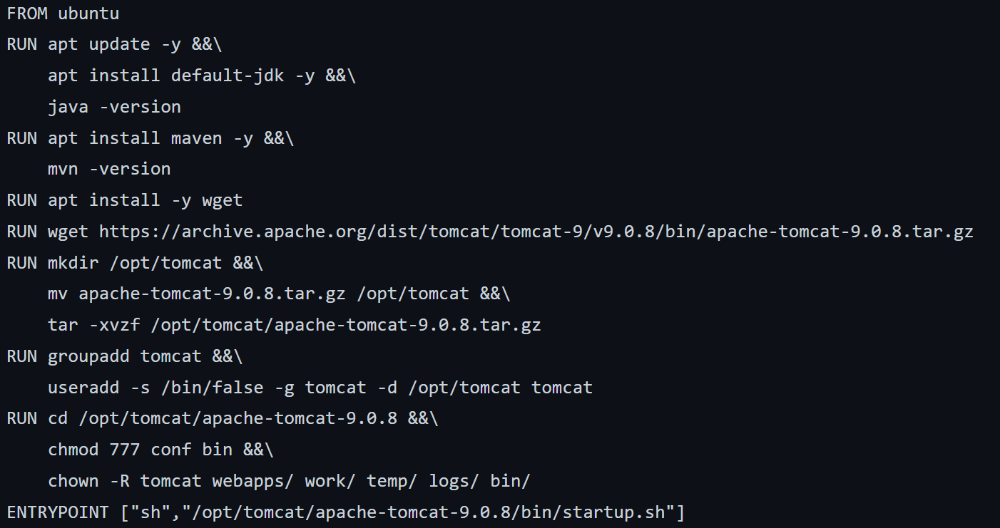
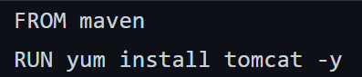
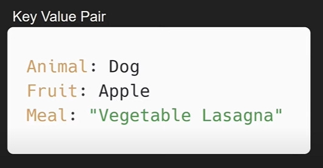
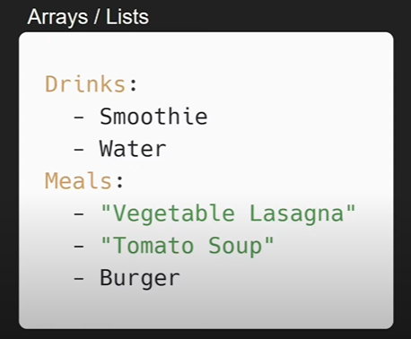
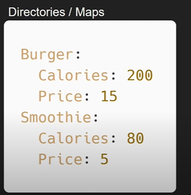
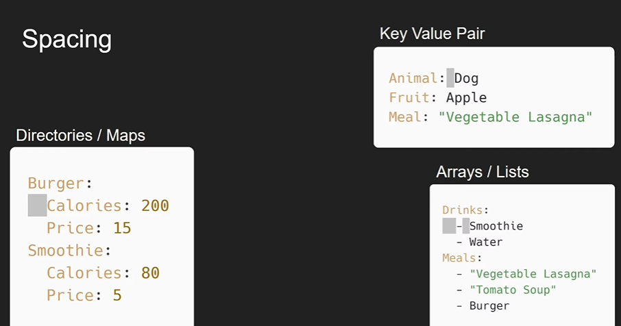
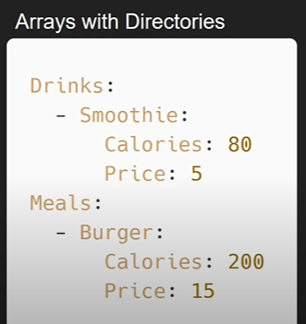
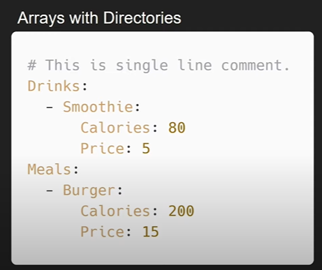

# Module 05: Docker Image Creation & Compose
* [Introduction to DockerFile]()
* [Describe Dockerfile options]()
* [Write Dockerfile to create Image]()
* [Multi-Stage Dockerfile]()
* [Docker Compose]()
* [Understanding docker-compose file]()

## Introduction to DockerFile
* A Dockerfile is a text document that contains all the commands a user could call on the command line to assemble an image.
* Dockerfile is used for automation of work by specifying all step that we want on docker image.
* Dockerfile is automated script of Docker images
* Manual image creation will become complicated when you want to test same setup on different OS flavor
* You have to create image for all flavor but by small changing in dockerfile you can create images for different flavor
* It have simple syntax for image and do many change automatically that will take more time while doing manually.
* Dockerfile have systematic step that can be understand by others easily and easy to know what exact configuration changed in base image.


## Describe Dockerfile options


#### Example of a DockerFile
```
FROM ubuntu:latest 
RUN apt update 
RUN apt install –y apache2 
RUN apt install –y apache2-utils 
RUN apt clean 
EXPOSE 80
CMD [“apache2ctl”, “-D”, “FOREGROUND”]
```
* Copy all the codes above and paste it into a file name DockerFile.
* To build the docker image, go to the working directory and run following commands.

```
sudo docker build -t apacheimage:1.0 .
```
* View the created image using.
```
sudo docker images
```
* To run the built docker image.
```
sudo docker run --name myapache -d -p 80:80 apacheimage:1.0
```

## Write Dockerfile to create Image

**Exercise - Do it yourself**
* Use nginx container.
* Upgrade & Update the container system with all the required command.
* Copy the configuration file from the host system to container.
* Copy the content for the website from host to container and chnage ownership of the files.
* Change the user and create a temp log files in tmp directory for the nginx to write its logs.

## Multi-Stage Dockerfile
* Best way to reduce the size of your docker image.
* What is happening here?



* Size of the image will approximately be like 700MB+
* Let's obseve another solution for the same problem.

* Size of the image will approximately be like 1GB+
* Can there be any optimal way to write a dockerfile.

* What's the difference in the last DockerFile.
  
## Introduction to Docker Compose
* Docker Compose is a tool that was developed to help define and share multi-container applications.
* With Compose, we can create a YAML file to define the services and with a single command, can spin everything up or tear it all down.

#### YAML crash course
* Yet Another Markup Language
* Key Value pairs declare like this:

* Arrays|List are declare like this:

* Maps are defined like this:

* YAML Spacing

* Arrays with directories

* Comments in YAMl


## Understanding docker-compose file
```
services:
  serviceName:
    build: ./pathToDockerFile
    volumes:
      - ./webApp:/usr/src/app
    ports:
      -  hostPort:containerPort
     
```

