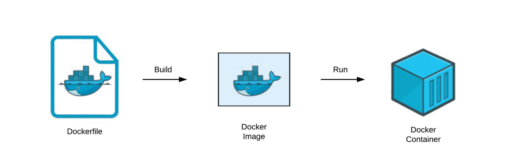
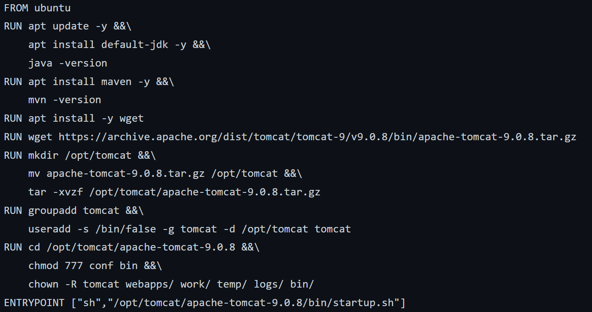
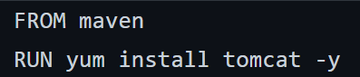
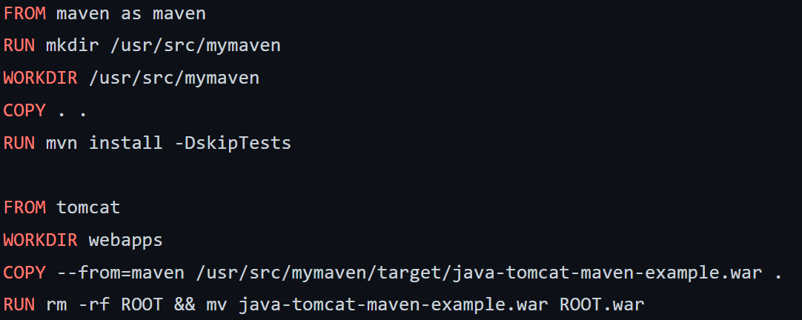
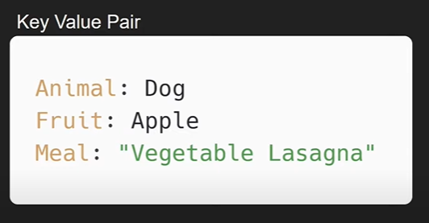
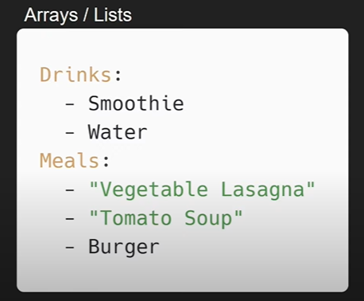
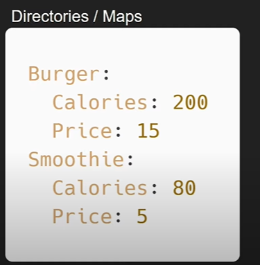
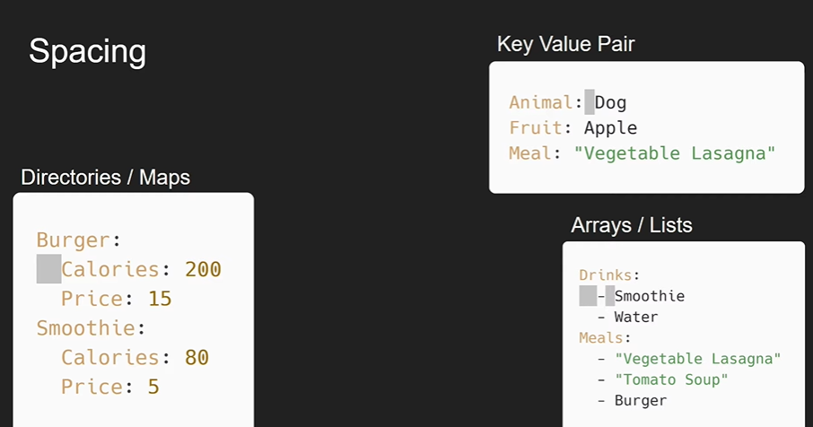
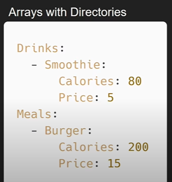
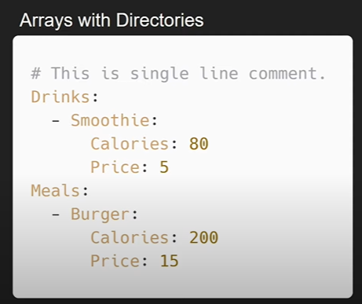

# Module 05: Docker Image Creation & Compose
* [Introduction to DockerFile](https://github.com/chaulags/learnDocker/tree/main/Module05#introduction-to-dockerfile)
* [Describe Dockerfile options](https://github.com/chaulags/learnDocker/tree/main/Module05#describe-dockerfile-options)
* [Write Dockerfile to create Image](https://github.com/chaulags/learnDocker/tree/main/Module05#write-dockerfile-to-create-image)
* [Multi-Stage Dockerfile](https://github.com/chaulags/learnDocker/tree/main/Module05#multi-stage-dockerfile)
* [Docker Compose](https://github.com/chaulags/learnDocker/tree/main/Module05#introduction-to-docker-compose)
* [Understanding docker-compose file](https://github.com/chaulags/learnDocker/tree/main/Module05#understanding-docker-compose-file)
* [Official Documentation Updates (2026)](#official-documentation-updates-2026)
* [Dockerfile Best Practices Update](#dockerfile-best-practices-update)
* [BuildKit Update](#buildkit-update)
* [Multi-Stage Pattern Update](#multi-stage-pattern-update)
* [Docker Compose Update](#docker-compose-update)


## Introduction to DockerFile
* A Dockerfile is a text document that contains all the commands a user could call on the command line to assemble an image.
* Dockerfile is used for automation of work by specifying all step that we want on docker image.
* Dockerfile is automated script of Docker images
* Manual image creation will become complicated when you want to test same setup on different OS flavor
* You have to create image for all flavor but by small changing in dockerfile you can create images for different flavor
* It have simple syntax for image and do many change automatically that will take more time while doing manually.
* Dockerfile have systematic step that can be understand by others easily and easy to know what exact configuration changed in base image.



## Describe Dockerfile options


#### Example of a DockerFile

> **Note (2026):** `ubuntu:latest` resolves to whatever is current at build time. For reproducible builds, pin a specific tag such as `ubuntu:24.04`. See [Dockerfile best practices](https://docs.docker.com/build/building/best-practices/). Combining `RUN` instructions into a single layer reduces image size and improves cache efficiency.

```dockerfile
FROM ubuntu:24.04
RUN apt-get update && apt-get install -y apache2 apache2-utils && apt-get clean
EXPOSE 80
CMD [“apache2ctl”, “-D”, “FOREGROUND”]
```
* Copy all the codes above and paste it into a file name DockerFile.
* To build the docker image, go to the working directory and run following commands.

```
sudo docker build -t apacheimage:1.0 .
```
* View the created image using.
```
sudo docker images
```
* To run the built docker image.
```
sudo docker run --name myapache -d -p 80:80 apacheimage:1.0
```


## Write Dockerfile to create Image

**Exercise - Do it yourself**
* Use nginx container.
* Upgrade & Update the container system with all the required command.
* Copy the configuration file from the host system to container.
* Copy the content for the website from host to container and chnage ownership of the files.
* Change the user and create a temp log files in tmp directory for the nginx to write its logs.


## Multi-Stage Dockerfile
* Best way to reduce the size of your docker image.
* What is happening here?



* Size of the image will approximately be like 700MB+
* Let's obseve another solution for the same problem.



* Size of the image will approximately be like 1GB+
* Can there be any optimal way to write a dockerfile.



* What's the difference in the last DockerFile.

> **Key concept:** In a multi-stage Dockerfile, the first stage (often called `builder`) compiles or packages the application. Only the build artifacts (not the build tools) are copied into the final, smaller runtime stage using `COPY --from=builder`. This is the primary mechanism for keeping production images lean. See [Multi-stage builds](https://docs.docker.com/build/building/multi-stage/).


## Introduction to Docker Compose
* Docker Compose is a tool that was developed to help define and share multi-container applications.
* With Compose, we can create a YAML file to define the services and with a single command, can spin everything up or tear it all down.


#### Benefits of Using Docker Compose:
* **Single host deployment** - This means you can run everything on a single piece of hardware.
* **Quick and easy configuration** - Due to YAML scripts.
* **High productivity** - Docker Compose reduces the time it takes to perform tasks.
* **Security** - All the containers are isolated from each other, reducing the threat landscape.


#### YAML crash course
* Yet Another Markup Language
* Key Value pairs declare like this:

* Arrays|List are declare like this:

* Maps are defined like this:

* YAML Spacing

* Arrays with directories

* Comments in YAMl



## Understanding docker-compose file
```yaml
services:
  serviceName:
    build: ./pathToDockerFile
    volumes:
      - ./webApp:/usr/src/app
    ports:
      -  hostPort:containerPort
     
```

---

## Official Documentation Updates (2026)

The sections below capture Docker's current guidance as of 2026 for building images and defining multi-container applications with Compose. All references point to official Docker documentation at [docs.docker.com](https://docs.docker.com).

---

## Dockerfile Best Practices Update

> **Source:** [https://docs.docker.com/build/building/best-practices/](https://docs.docker.com/build/building/best-practices/)

Key practices for writing production-quality Dockerfiles:

**1. Pin base image tags**
Using `ubuntu:latest` is convenient for learning but non-deterministic in CI/CD pipelines. Pinning to a specific tag (e.g., `ubuntu:24.04`) makes builds reproducible.

**2. Combine RUN instructions**
Each `RUN` instruction creates a new image layer. Combining related commands in a single `RUN` reduces image size and improves cache hit rates.

```dockerfile
# Avoid: separate layers for each command
RUN apt-get update
RUN apt-get install -y curl
RUN apt-get clean

# Prefer: single layer
RUN apt-get update && apt-get install -y curl && apt-get clean
```

**3. Use a .dockerignore file**
A `.dockerignore` file tells the Docker build daemon which files to exclude from the build context. This reduces context size and prevents accidentally including secrets or large files.

```
# .dockerignore example
.git
*.log
node_modules
.env
```

**4. Run as a non-root user**
Containers run as root by default. Use the `USER` instruction to switch to a lower-privilege user for better security.

```dockerfile
RUN useradd -m appuser
USER appuser
```

**5. Build cache**
Docker caches each layer. Instructions that change frequently (like `COPY . .`) should appear late in the Dockerfile so that earlier, stable layers (like `apt-get install`) remain cached across builds.

---

## BuildKit Update

> **Source:** [https://docs.docker.com/build/buildkit/](https://docs.docker.com/build/buildkit/)

**What is BuildKit?**
BuildKit is Docker's modern build engine. It is the default backend for `docker build` since Docker Engine 23.0. It replaces the legacy builder with a faster, more efficient build system that supports:

- Parallel build stage execution
- Better cache management
- Secret and SSH forwarding during builds
- Inline cache export/import

**Enabling BuildKit (pre-23.0)**
If you are on an older Docker version, enable BuildKit via an environment variable:

```bash
DOCKER_BUILDKIT=1 sudo docker build -t myimage:1.0 .
```

**Checking your Docker version**
```bash
sudo docker version
```
Docker Engine 23.0 and later use BuildKit by default. No extra flag is needed.

**BuildKit-only Dockerfile syntax**
BuildKit unlocks advanced `RUN` mount options. For example, using a cache mount to speed up package installation:

```dockerfile
# syntax=docker/dockerfile:1
FROM ubuntu:24.04
RUN --mount=type=cache,target=/var/cache/apt \
    apt-get update && apt-get install -y curl
```

---

## Multi-Stage Pattern Update

> **Source:** [https://docs.docker.com/build/building/multi-stage/](https://docs.docker.com/build/building/multi-stage/)

Multi-stage builds use named stages to separate build-time dependencies from the final runtime image. The `AS` keyword names a stage; `COPY --from=<stage>` copies only the needed artifacts.

**Modern named-stage example:**

```dockerfile
# Stage 1: build
FROM golang:1.22 AS builder
WORKDIR /app
COPY . .
RUN go build -o myapp .

# Stage 2: minimal runtime image
FROM debian:bookworm-slim AS runtime
WORKDIR /app
COPY --from=builder /app/myapp .
CMD ["./myapp"]
```

**Why it matters:**
- The `builder` stage includes the full Go toolchain (~600 MB+).
- The `runtime` stage contains only the compiled binary on a slim base (~80 MB).
- Docker discards intermediate stages by default; only the final stage is shipped.

---

## Docker Compose Update

> **Sources:**
> - [https://docs.docker.com/reference/compose-file/](https://docs.docker.com/reference/compose-file/)
> - [https://docs.docker.com/compose/networking/](https://docs.docker.com/compose/networking/)
> - [https://docs.docker.com/compose/profiles/](https://docs.docker.com/compose/profiles/)

**Compose file naming (2026)**
The preferred filename is `compose.yaml` (not `docker-compose.yml`), though both are supported. The `version` top-level key is deprecated and should be omitted in new files.

**Service networking**
By default, all services in a Compose file are placed on a shared network named after the project directory. Services can reach each other by their service name as a hostname. No manual link or IP configuration is needed.

```yaml
services:
  web:
    image: nginx:alpine
  db:
    image: postgres:16
```

Here `web` can reach `db` at hostname `db` automatically.

**Environment variables**
Use the `environment` key for service-level variables, or load from a `.env` file automatically:

```yaml
services:
  app:
    image: myapp:1.0
    environment:
      - DATABASE_URL=postgres://db:5432/mydb
```

**Health checks**
Define a `healthcheck` so that dependent services only start after the dependency is healthy:

```yaml
services:
  db:
    image: postgres:16
    healthcheck:
      test: ["CMD-SHELL", "pg_isready -U postgres"]
      interval: 10s
      timeout: 5s
      retries: 5
```

**Profiles**
Profiles allow optional services that are only started when explicitly requested:

```yaml
services:
  db:
    image: postgres:16
  debug-tools:
    image: busybox
    profiles:
      - debug
```

Start with the debug profile: `sudo docker compose --profile debug up`

**Starting and stopping**
```bash
# Start all services in the background
sudo docker compose up -d

# Stop and remove containers
sudo docker compose down
```

**Modern compose.yaml template:**

```yaml
# compose.yaml — no 'version' key needed (deprecated)
services:
  web:
    build: .
    ports:
      - "80:80"
    depends_on:
      db:
        condition: service_healthy
    environment:
      - APP_ENV=production
    restart: unless-stopped

  db:
    image: postgres:16
    environment:
      POSTGRES_PASSWORD: example
    volumes:
      - db-data:/var/lib/postgresql/data
    healthcheck:
      test: ["CMD-SHELL", "pg_isready -U postgres"]
      interval: 10s
      timeout: 5s
      retries: 5

volumes:
  db-data:
```

> Volumes, networks, and health checks shown above follow the current [Compose file specification](https://docs.docker.com/reference/compose-file/).

