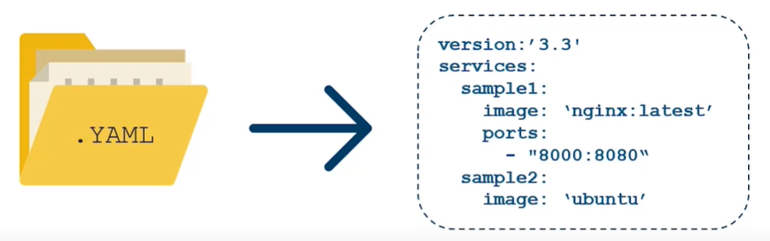
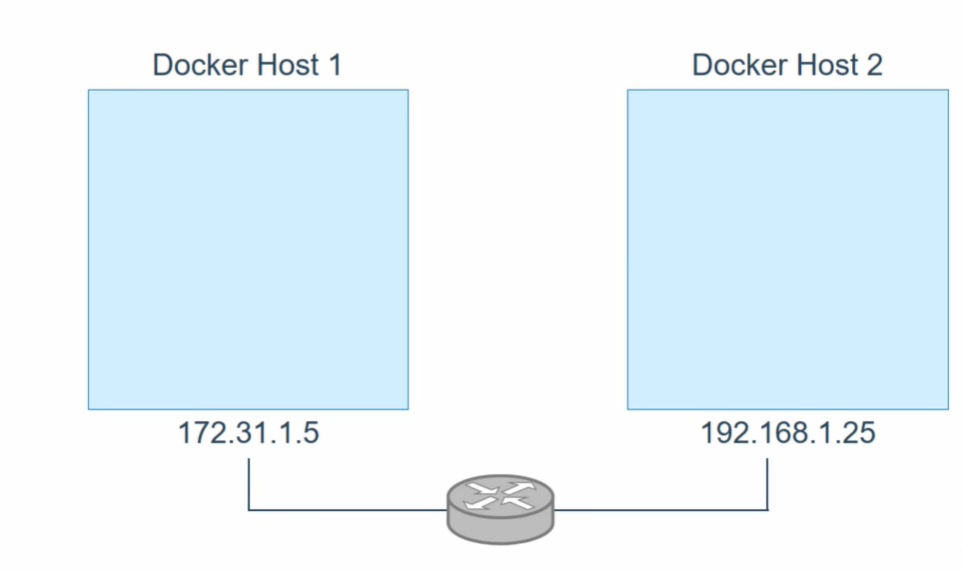
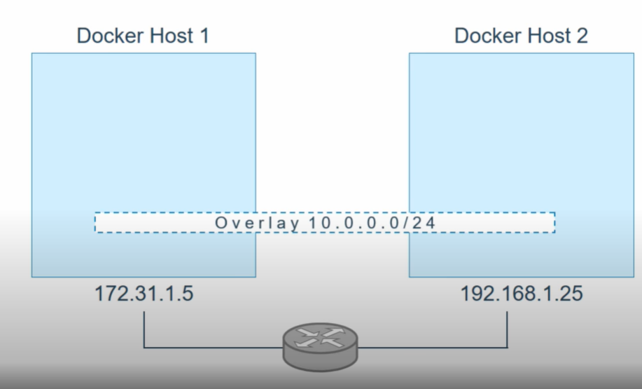
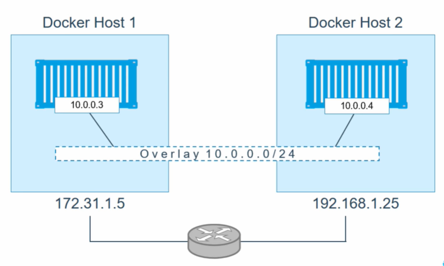

# Docker Swarm Continued (Deployment in Swarm)
* Multiple Deployment at the same time.
* In real world, there are multiple container with different services.
* Frontend, backend, database, token generator, API requests & other.
* This is where **Docker Stack Deploy** comes around.
* Docker Stack Deploy uses YAML file with all the configuration to deploy everything at once.


* Command used to deploy a Swarm Stack.
```
sudo docker stack deploy -c <yamlFile>.yml <stackName>
```
* Use *sudo docker ps* to view extra information.
* There are no replicas in any other worker nodes.
* As default replicas is 1.
* Using following to view the number of replicas.
```
sudo docker service ls
```


## Scaling
* Scaling is the process of adding or removing compute, storage, and network services to meet the demands a workload makes for resources, to maintain availability and performance as utilization increases.

* Since there are only 1 replica for a service.
* We need to upscale it.
* Following commands can be used to upscale or down your service as desired.

```
sudo docker service scale <serviceID>=<number of **replicas**>
```
* View the replicas using.
```
sudo docker stack ps <stackName>
```
> **Note:** `docker stack ps <stackName>` lists all tasks across all services in a stack. Use `docker service ps <serviceID>` to inspect tasks for a specific service.


## Rolling Updates
* Updating an image in the service, while the service is running.
* To reduce the downtime as less as possible.
* Service Level agreement binds technical team to take such procedures.
```
sudo docker service create --name <service Name> --replicas 3 <image:Version>
```
```
sudo docker service update --image <image:NewVersion> <service Name> 
```


## Draining Nodes
* In earlier steps of the tutorial, all the nodes have been running with ACTIVE availability. 
* The swarm manager can assign tasks to any ACTIVE node, so up to now all nodes have been available to receive tasks.
* Sometimes, such as planned maintenance times, you need to set a node to DRAIN availability.
* DRAIN availability prevents a node from receiving new tasks from the swarm manager.
* It also means the manager stops tasks running on the node and launches replica tasks on a node with ACTIVE availability.
```
sudo docker node update --availability drain <nodeID>
```
* All the loads handled by the drain node will be transfered to manager node.


## Connecting Service to a Network
* The overlay network driver creates a distributed network among multiple Docker daemon hosts.
* This network sits on top of (overlays) the host-specific networks, allowing containers connected to it (including swarm service containers) to communicate securely when encryption is enabled.
 







* Let's create a overlay network driver first.
```
sudo docker network create --driver overlay my-overlay
```
* Overlay driver is created. Now use the network in services.
```
sudo docker service create --replicas 3 --network my-overlay --name testing nginx:latest
```
* Update the network connection to existing service
```
sudo docker service update --network-add mynewnetwork <service-name>
```
* Remove the network
```
sudo docker service update --network-rm myoldnetwork <service-name>
```
* View changes
```
sudo docker service inspect --pretty <service-name>
```


## Storage in Service
* Adding volume to the service
```
sudo docker service create --mount src=<volume-name>,dst=<container-path> --name myservice <image:version>
```
* View changes
```
sudo docker service inspect --pretty <service-name>
```

## Replicated & Global
**Replicated**: The tasks are replicated to a specified number using the ***--replicas*** flag and then each task is assigned to a node.
```
sudo docker service create --name <service-name> --replicas 3 <image:version>
```

**Global**: This type of service runs one task on every node. Eg - Monitoring Agents, Antivirus Scanners.
```
sudo docker service create --name <service-name> --mode global <image:version>
```

## Reserving Memory & CPU

> **Source:** [https://docs.docker.com/reference/cli/docker/service/create/](https://docs.docker.com/reference/cli/docker/service/create/)

Docker Swarm supports two distinct resource control mechanisms per service: **reservations** and **limits**.

**Reservations** (`--reserve-cpu`, `--reserve-memory`)
A reservation guarantees that a node has at least this much resource available before a task is scheduled on it. The scheduler will not place a task on a node that cannot satisfy the reservation.

**Limits** (`--limit-cpu`, `--limit-memory`)
A limit caps the maximum resource a container may consume. If a container exceeds its memory limit, the kernel OOM killer may terminate it.

| Flag | Effect |
|---|---|
| `--reserve-cpu` | Minimum CPU guaranteed at scheduling time |
| `--reserve-memory` | Minimum memory guaranteed at scheduling time |
| `--limit-cpu` | Maximum CPU the container may use |
| `--limit-memory` | Maximum memory the container may use |

**Example: create a service with reservations and limits:**
```bash
sudo docker service create \
  --name myapp \
  --replicas 3 \
  --reserve-cpu 0.5 \
  --reserve-memory 256m \
  --limit-cpu 1 \
  --limit-memory 512m \
  nginx:alpine
```

**Update resource constraints on a running service:**
```bash
sudo docker service update \
  --limit-memory 1g \
  --reserve-memory 512m \
  myapp
```

> CPU values are expressed as fractions of a CPU core (e.g., `0.5` = half a core). Memory values accept suffixes: `b`, `k`, `m`, `g`.

---

## Official Documentation Updates (2026)

The sections below capture current Docker Swarm guidance as of 2026. All references point to official Docker documentation at [docs.docker.com](https://docs.docker.com).

---

## Rolling Update Advanced Options Update

> **Sources:**
> - [https://docs.docker.com/engine/swarm/swarm-tutorial/rolling-update/](https://docs.docker.com/engine/swarm/swarm-tutorial/rolling-update/)
> - [https://docs.docker.com/reference/cli/docker/service/update/](https://docs.docker.com/reference/cli/docker/service/update/)

The basic `docker service update --image` command performs a rolling update, but the default behaviour updates one replica at a time with no delay. The flags below give you precise control over how updates roll out and how failures are handled.

| Flag | Purpose | Default |
|---|---|---|
| `--update-parallelism` | Number of tasks updated simultaneously | `1` |
| `--update-delay` | Delay between each update batch | `0s` |
| `--update-failure-action` | What to do if a task fails during update: `pause` or `rollback` | `pause` |
| `--rollback-parallelism` | Number of tasks rolled back simultaneously | `1` |
| `--rollback-delay` | Delay between rollback batches | `0s` |

**Example: controlled rolling update (2 at a time, 10 s delay, auto-rollback on failure):**
```bash
sudo docker service update \
  --image nginx:1.27 \
  --update-parallelism 2 \
  --update-delay 10s \
  --update-failure-action rollback \
  --rollback-parallelism 2 \
  --rollback-delay 5s \
  myapp
```

**Manually trigger a rollback:**
```bash
sudo docker service rollback myapp
```

**Embed update policy at service creation time:**
```bash
sudo docker service create \
  --name myapp \
  --replicas 5 \
  --update-parallelism 2 \
  --update-delay 10s \
  --update-failure-action rollback \
  nginx:alpine
```

---

## Swarm Secrets and Configs Update

> **Sources:**
> - [https://docs.docker.com/engine/swarm/secrets/](https://docs.docker.com/engine/swarm/secrets/)
> - [https://docs.docker.com/engine/swarm/configs/](https://docs.docker.com/engine/swarm/configs/)

**Secrets** store sensitive data (passwords, API tokens, TLS keys). They are encrypted in the Raft log and mounted read-only inside the container at `/run/secrets/<secret-name>`.

```bash
# Create a secret from stdin
echo "s3cr3tpassword" | sudo docker secret create db_password -

# Create a secret from a file
sudo docker secret create tls_cert ./server.crt

# List secrets
sudo docker secret ls

# Use a secret in a service
sudo docker service create \
  --name mydb \
  --secret db_password \
  postgres:16

# Remove a secret (only when no service references it)
sudo docker secret rm db_password
```

**Configs** store non-sensitive configuration data (config files, scripts). They are mounted inside the container at a path you specify and are stored unencrypted in the Raft log.

```bash
# Create a config from a file
sudo docker config create nginx_conf ./nginx.conf

# List configs
sudo docker config ls

# Use a config in a service (mounted at /etc/nginx/nginx.conf)
sudo docker service create \
  --name webserver \
  --config source=nginx_conf,target=/etc/nginx/nginx.conf \
  nginx:alpine
```

| | Secrets | Configs |
|---|---|---|
| **Storage** | Encrypted in Raft | Unencrypted in Raft |
| **Mount path** | `/run/secrets/<name>` (default) | Configurable |
| **Use for** | Passwords, keys, tokens | Config files, scripts |
