# Module 06: Container Orchestration using Docker Swarm
* Container Orchestration
* Docker Swarm Introduction
* Docker Swarm Architecture
* Docker Swarm and distribution strategies
* [Official Documentation Updates (2026)](#official-documentation-updates-2026)
* [Swarm Manager Quorum and Fault Tolerance Update](#swarm-manager-quorum-and-fault-tolerance-update)
* [Swarm Security Update](#swarm-security-update)
* [Swarm vs Kubernetes Context Update](#swarm-vs-kubernetes-context-update)
<!-- * Installing Docker EE
* Installing Universal Control Plane ( UCP )
* Creating Users and Teams in UCP
* DTR Installation
* Create a DTR Repo
* Users and Teams in DTR
* Setting Permissions in DTR -->

## Container Orchestration
* Container Orchestration is the process of deploying and maintaining large number of containers & services for the application to run as intended.
* Automation of much of the operational effort required to run containerized workloads and services.
* Manage a container's lifecycle, including provisioning, deployment, scaling (up and down), networking, load balancing and more.
* Why Orchestration?
  * **Configuration and scheduling**
  * **Provisioning and deployment**
  * **Health monitoring**
  * **Resource allocation**
  * **Redundancy and availability**
  * **Updates and upgrades**
  * **Scaling or removing containers to balance workloads across the infrastructure**
  * **Moving containers between hosts**
  * **Load balancing and traffic routing**
  * **Securing container interactions**


* Container Orchestration Tools
  * Docker Swarm
  * Kubernetes
  * Mesos Marathon
  * Nomad
  * Amazon EKS
  * Azure Kubernetes Service


## Docker Swarm Introduction
* Docker Swarm is another popular open source container orchestration platform.
* The cluster management and orchestration features embedded in the Docker Engine are built using swarmkit.
* [Swarmkit](https://github.com/moby/swarmkit) is a separate project which implements Docker’s orchestration layer and is used directly within Docker.

## Docker Swarm Architecture

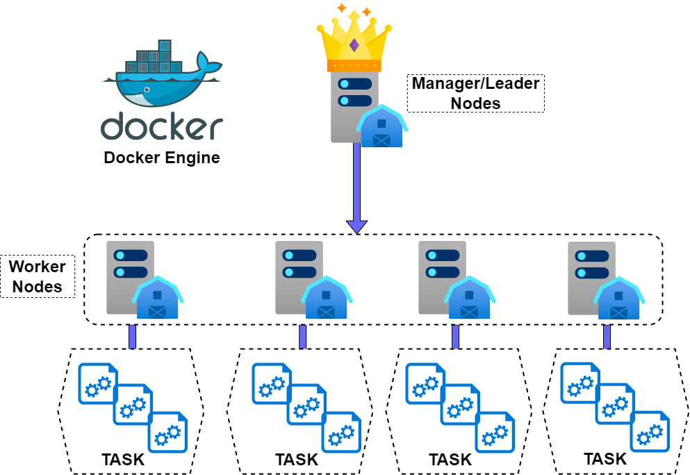

* **Services & Tasks**: 
  * A service is the definition of the tasks to execute on the manager or worker nodes.
  * It is the central structure of the swarm system and the primary root of user interaction with the swarm.
  * For global services, the swarm runs one task for the service on every available node in the cluster.
  * **Task** carries a Docker container and the commands to run inside the container. It is the atomic scheduling unit of swarm.
  * Manager nodes assign tasks to worker nodes according to the number of replicas set in the service scale.


* **Nodes**: A node is an instance of the Docker engine participating in the swarm.
  * **Manager Nodes**:
    * To maintain the cluster state.
    * Allocating IP addresses to tasks.
    * Accepting commands and creating service objects.
    * Assigning tasks to nodes.
    * Scheduling of Services.
    * Serving Swarm mode HTTP API endpoints.
    * Instructing a worker to run a task.
  * **Worker Nodes**
    * A manager node can exist without a worker node
    * Worker cannot exist without a manager.
    * Manager node assigns tasks to worker nodes.


## Docker Swarm Tutorials
This part mostly contains the working of docker swarm and its deployment features.

#### Initialize Docker Swarm
* Following command will help you understand sub-feature of the docker-swarm.
```
sudo docker swarm help
```
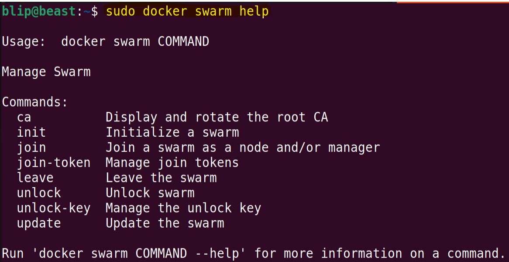

* To initialize the docker swarm:
```
sudo docker swarm init --advertise-addr <ipAddress>
```
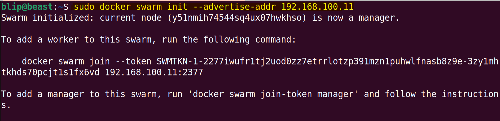

* The above system is now the manager for the docker swarm cluster.
* We can also see the instruction to add more worker to this swarm cluster.
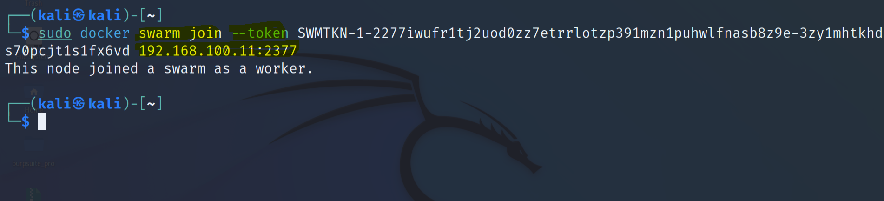

* To view more info about the docker-swarm:
```
sudo docker info
```
*(Scroll to the Swarm section in the output.)*
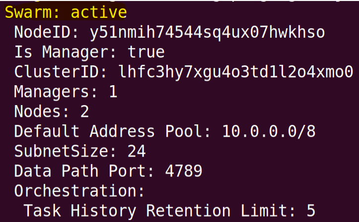

#### Manage Nodes in Docker Swarm Cluster
* To view all the nodes:
```
sudo docker node ls
```
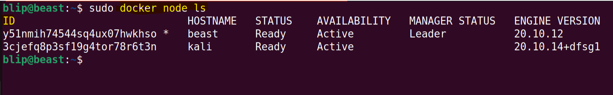

* How worker node leave a docker swarm.
```
sudo docker swarm leave --force
```
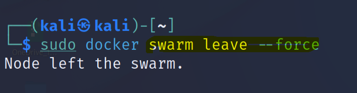

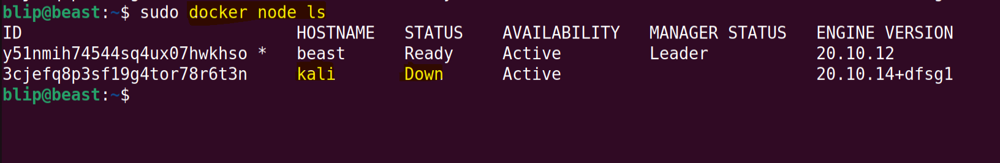

* Remove the node from docker swarm cluster's manager.
```
sudo docker node rm <nodeID>
```
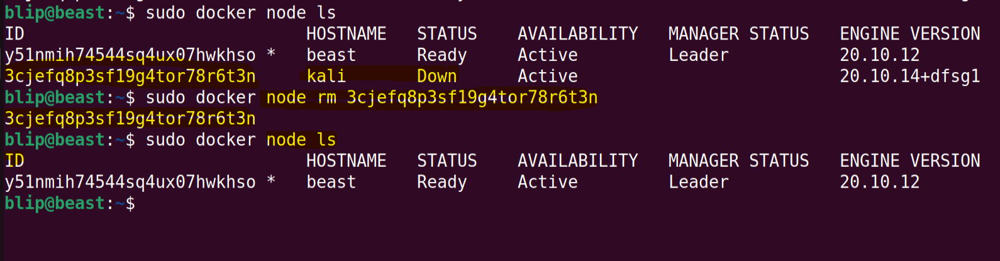

* If you want to view the token to add a worker to the cluster,
```
sudo docker swarm join-token worker
```
* If you want to add a node as **MANAGER**, the token to add a node to the cluster,
```
sudo docker swarm join-token manager
```
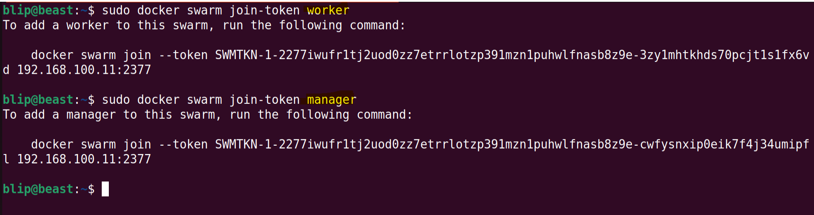

#### Docker Service Management
* Service is used to deploy an application image.
* Service will define how your task is going to be executed.
* For example service defines the replicas of the docker container to load balance the request for all the users & customers.
* Replicas are mostly deployed in different worker nodes so that even if any worker shuts down, another instance in another worker will respond to the request.
* Service might be slow, but availability of the service will not stop.
* **REDUNDANCY**

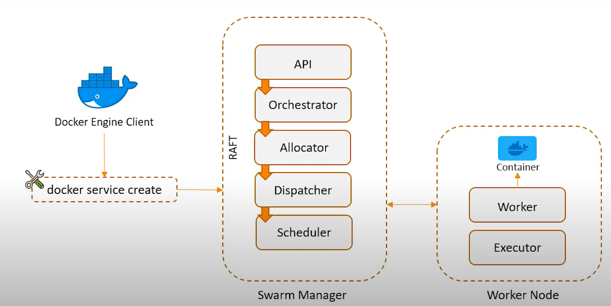

* To create a docker service:
```
sudo docker service create --replicas <number of instance> -p <port:Mapping> <image> 
```
* View services in all the nodes:
```
sudo docker service ls
```
```
sudo docker service ps <serviceID>
```
* Let's try and remove any replicas.
```
sudo docker rm -f <containerID>
```
* Wait for ittttt.
* Check using following commands.
```
sudo docker ps
```
* Delete a Service
```
sudo docker service rm <serviceID>
```
> **Note:** `docker rm` removes individual containers. `docker service rm` removes an entire Swarm service and all its tasks.
* Extra information of a Service
```
sudo docker service inspect --pretty <serviceID or serviceName>
```
* 

---

## Official Documentation Updates (2026)

The sections below reflect Docker Swarm's current behaviour and recommended practices as of 2026. All references point to official Docker documentation at [docs.docker.com](https://docs.docker.com).

---

## Swarm Manager Quorum and Fault Tolerance Update

> **Source:** [https://docs.docker.com/engine/swarm/admin_guide/](https://docs.docker.com/engine/swarm/admin_guide/)

Docker Swarm uses the **Raft consensus algorithm** to maintain a consistent cluster state across all manager nodes. Understanding quorum is essential when designing a highly available Swarm cluster.

**How quorum works:**
Swarm requires a majority (quorum) of manager nodes to agree before any state change is committed. If fewer than a quorum of managers are available, the cluster stops accepting new tasks to prevent split-brain conditions.

**Fault tolerance formula:**
With `N` manager nodes, the cluster can tolerate the loss of `(N-1)/2` managers (rounded down).

| Manager nodes | Quorum required | Fault tolerance |
|:---:|:---:|:---:|
| 1 | 1 | 0 |
| 3 | 2 | 1 |
| 5 | 3 | 2 |
| 7 | 4 | 3 |

**Recommendations:**
- Use **3 or 5 manager nodes** for production clusters. This provides fault tolerance without excessive overhead.
- Avoid even numbers of managers; an even count does not improve fault tolerance over the next lower odd number.
- Worker nodes do not participate in Raft and do not affect quorum.

**Promoting a worker to manager:**
```bash
sudo docker node promote <nodeID>
```

**Demoting a manager to worker:**
```bash
sudo docker node demote <nodeID>
```

---

## Swarm Security Update

> **Source:** [https://docs.docker.com/engine/swarm/secrets/](https://docs.docker.com/engine/swarm/secrets/)

**Mutual TLS (automatic)**
When you initialise a Swarm, Docker automatically provisions a certificate authority (CA) and issues TLS certificates to every node. All communication between managers and workers is encrypted and mutually authenticated. Certificates are rotated automatically every 90 days by default.

You can change the rotation period:
```bash
sudo docker swarm update --cert-expiry 48h
```

**Docker Secrets**
Secrets allow sensitive data (passwords, API keys, TLS certificates) to be stored encrypted in the Swarm Raft log and mounted into containers at runtime as files, without embedding them in images or environment variables.

Create a secret:
```bash
echo "mypassword" | sudo docker secret create db_password -
```

List secrets:
```bash
sudo docker secret ls
```

Use a secret in a service (mounted at `/run/secrets/db_password` inside the container):
```bash
sudo docker service create \
  --name mydb \
  --secret db_password \
  postgres:16
```

> Secrets are only available to services explicitly granted access. They are never stored in plain text on disk on worker nodes.

---

## Swarm vs Kubernetes Context Update

> **Source:** [https://docs.docker.com/engine/swarm/](https://docs.docker.com/engine/swarm/)

Docker Swarm is Docker's built-in orchestration tool. It is intentionally simpler than Kubernetes and is a good starting point for learning container orchestration concepts.

| | Docker Swarm | Kubernetes |
|---|---|---|
| **Setup complexity** | Low: built into Docker Engine | Higher: separate control plane components |
| **Learning curve** | Gentle: reuses Docker CLI concepts | Steeper: new resource types and tooling |
| **Scale** | Suitable for small to medium fleets | Designed for large, complex deployments |
| **Ecosystem** | Smaller | Large, with many third-party integrations |
| **Official docs** | [docs.docker.com/engine/swarm/](https://docs.docker.com/engine/swarm/) | [kubernetes.io](https://kubernetes.io) |

For production workloads at scale, Kubernetes is more widely adopted. Swarm remains a valid choice when simplicity and tight Docker integration are priorities.